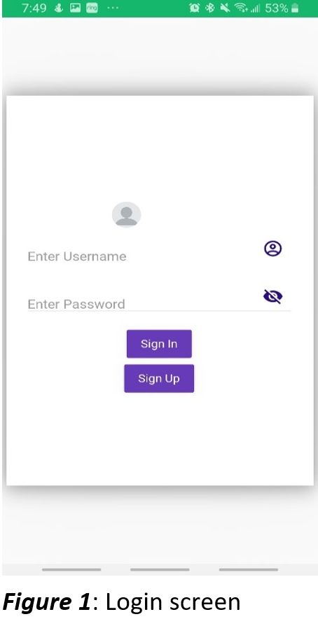
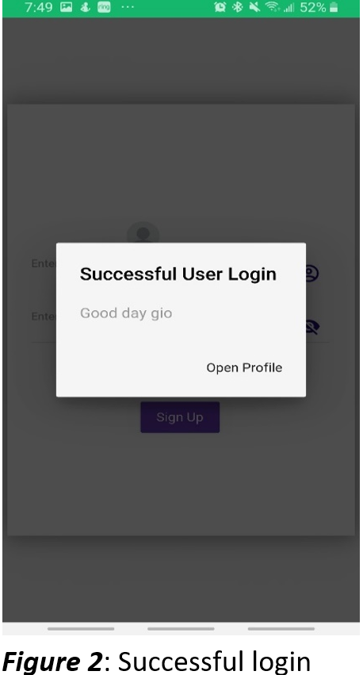
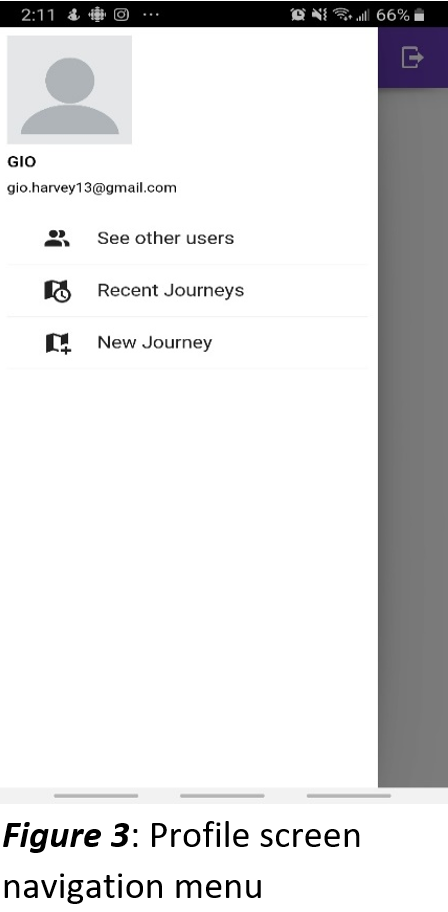
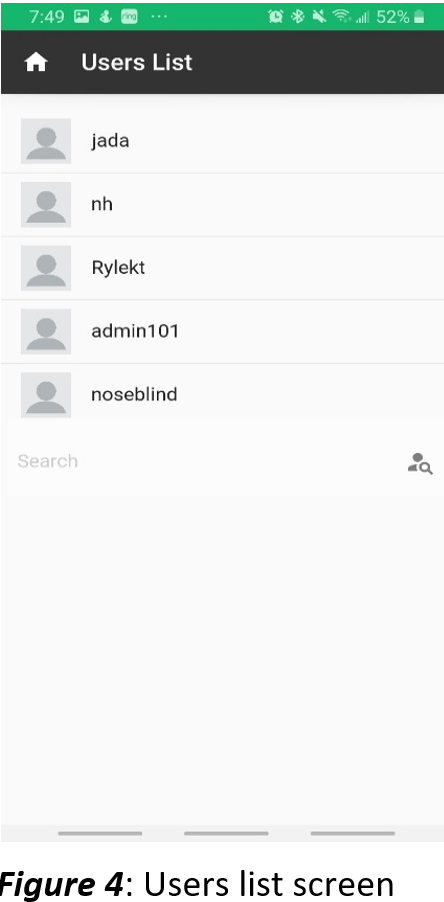
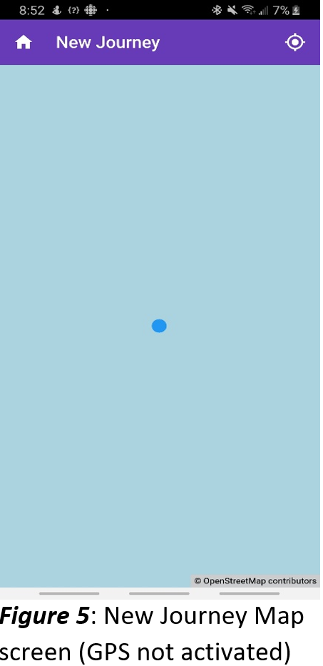
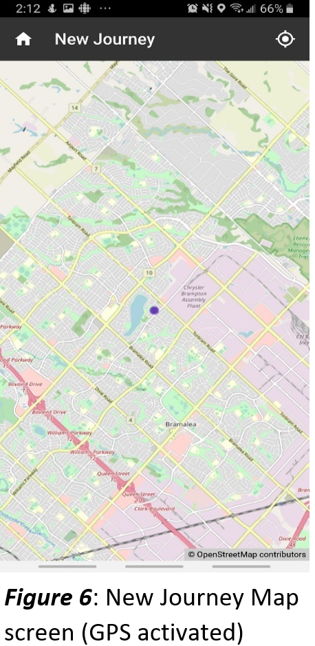
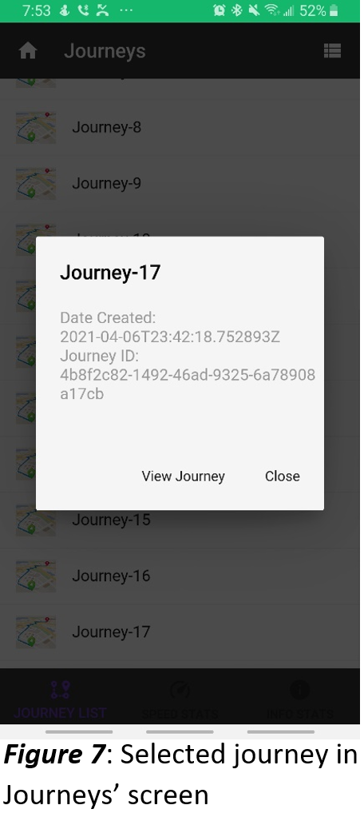
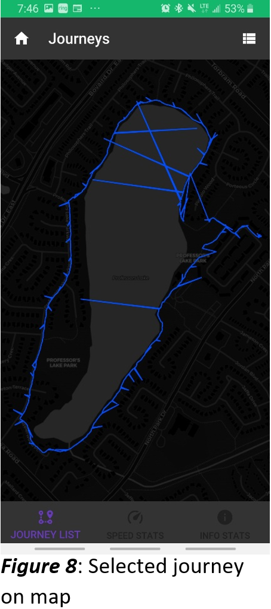
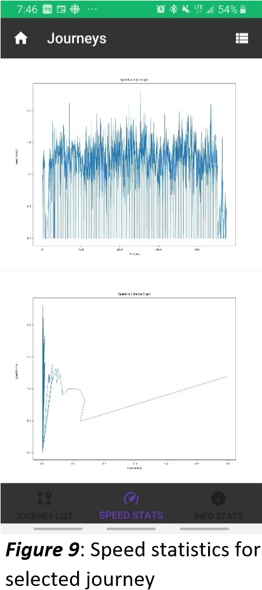

# CypherNest-Fitness
- A journey tracker app that allows the user to use their phones GPS
- Visualize their journey and journey history and see other users.

## Install it on Android
- Install the lastest build in the `APK_files/cypher_app-0.8.7.apk`

## Basic Documentation

* [Diagrams for Application](https://drive.google.com/file/d/1l7GN18XhpE-U18DkXAxxFoofquFUikrs/view?usp=sharing)
* [Link to Google Collab to build application](https://colab.research.google.com/drive/1v_hddp6fp7sMj-uw1yOZLp89kGDaURbh?usp=sharing)
* [Link to Github Repository](https://github.com/Giovanni-theGeomaticstech/CypherNest-Fitness.git)

### User Interface
* Divided in 6 main screens all contained by `main.py`
    * Profile_screen.py
    * Login_screen.py
    * Journeys_screen.py
    * Map_screen.py
      * `mapscreen.kv` used to aid in screen setup and initialization
      * `locationblinker.kv` used to aid in screen setup and initialization for the blinker
    * Other_users_screen.py
    * Registration_screen.py
    
### Backend Rest API endpoints
* Heroku free hosting
* Postgres Database
* Contained within `connections.py`
    * `api/`
        #### POST
        * `login/`
        * `register/`
        * `new_journey/`
          
        #### GET
        * `logout/`
        * `retrieve_journey/`
        * `journey_list/`
        * `user_list/`
    
### Building Application
* [Link to Google Collab to build application](https://colab.research.google.com/drive/1v_hddp6fp7sMj-uw1yOZLp89kGDaURbh?usp=sharing)
* `buildozer.spec` file consists of the configuration to make Android App

#### COnfiguration involves (buildozer.spec)
* The python packages used in the application
* The `sdk` and `ndk` files
* The `gradle` configurations

### Application Images

   
   
   
   
   
   
   
   
  

